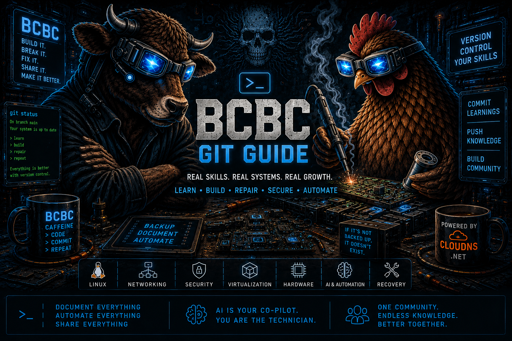

cd ~/Documents/BCBC-GitHub-Pages
cat > README.md <<'EOF'
# BCBC Git & GitHub Guide

A technician-first Git and GitHub learning guide by **BCBC Technician Tools and Learning System**.

This project helps beginners, repair techs, career learners, and hands-on builders understand Git, GitHub, version control, backups, and practical project workflow without fear or confusion.

## Live Site

https://wjfranza.github.io/bcbc-git-guide/

## What this project teaches

- Git basics
- GitHub Pages workflow
- Safe project backups
- Practical version control habits
- Technician-style documentation
- AI-assisted learning and project building

## Infrastructure Support

Special thank you to **ClouDNS** for supporting reliable DNS infrastructure for BCBC projects.

## Credits

Built by **BCBC**, **Mikey_LikesIT**, and **ChatGPT**.

Ideas, design, and concepts by **William J Franza**, assisted by ChatGPT.
EOF
